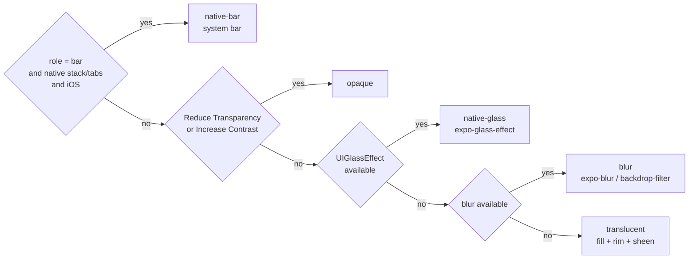

# FluxNative UI

React Native components whose navigation chrome is **always Liquid Glass**, styled with **Tailwind v4 classes** and built so that **language models write it correctly**.

> **Status: v0.** The packages ship as 0.x TypeScript source packages and are **not on npm yet**. APIs will change before 1.0; once published, pin exact versions.

```tsx
import { Text, View } from 'react-native';
import { Screen, AppBar } from '@fluxnative/ui';

export default function Home() {
  return (
    <Screen contentContainerClassName="gap-4 px-4">
      <AppBar title="Discover" largeTitle />
      <View className="rounded-2xl bg-card p-4">
        <Text className="text-lg font-semibold text-card-foreground">Today</Text>
      </View>
    </Screen>
  );
}
```

## Why

- **Glass is the default, not an option.**
  - On iOS, `AppBar` and `FluxTabs` *are* the system navigation and tab bars, so iOS 26+ draws real Liquid Glass and owns the accessibility behaviour.
  - Everywhere else FluxNative UI draws glass itself, choosing the best tier the device can render.
- **Tailwind syntax as-is.**
  - Spacing, radius and type use Tailwind's own scale, because that is what models already write.
  - Colors are the one exception: only semantic names (shadcn/ui names) exist, so dark mode can't break.
- **Small, closed vocabulary.**
  - The whole API fits in an 8 KB `AGENTS.md` index ([`docs/llm/AGENTS.index.md`](docs/llm/AGENTS.index.md)).
  - Props are closed string unions, so TypeScript rejects unknown values.
  - The runtime resolver warns on unknown classes and names the valid alternative.
  - `pnpm typecheck` rejects unknown prop values; there is no ESLint plugin yet (see Known gaps).

## The glass ladder



There is no prop that turns glass off. Only the platform and the user's accessibility settings move a surface down the ladder, and they do it live.

## Packages

| Package | What it does |
|---|---|
| `@fluxnative/tokens` | W3C DTCG 2025.10 tokens (`tokens/*.tokens.json`), compiled to TypeScript constants and a Uniwind `global.css` (`fluxnative-tokens global-css`) |
| `@fluxnative/glass` | Tier resolver, `GlassSurface`, `GlassGroup` and the adapter registry. `@fluxnative/glass/expo` registers expo-glass-effect and expo-blur |
| `@fluxnative/ui` | `Screen`, `AppBar`, `TabBar`, `Glass`. `@fluxnative/ui/expo-router` provides `FluxStack` and `FluxTabs` |
| `@fluxnative/tw-runtime` | Resolves the same class contract at runtime, for hosts with no build step (the Flux WebView, Snack) |
| `@fluxnative/icons` | One closed icon table (SF Symbol, Material Symbol, SVG path) and an `<Icon>`; `FluxTabs.Tab iconName` |
| `@fluxnative/catalog` | Emits the tokens, `Icon` and ten primitives into a Flux template as dependency-free files ([`docs/topics/catalog.md`](docs/topics/catalog.md)) |

## Install in an Expo app

For an Expo Router app on SDK 57, once 0.1.0 is on npm.

1. Install the packages and their peers:
   ```bash
   npx expo install @fluxnative/ui @fluxnative/glass @fluxnative/tokens @fluxnative/icons uniwind tailwindcss expo-glass-effect expo-blur react-native-safe-area-context react-native-svg
   ```
   Pin the `@fluxnative/*` packages to one exact version (`"0.1.0"`, not `"^0.1.0"`); they are released together.
2. Generate the Uniwind CSS entry file from the tokens:
   ```bash
   npx fluxnative-tokens global-css --out src/global.css
   ```
   Re-run it after each `@fluxnative/tokens` upgrade instead of editing the file. In CI, `--check` exits 1 when the file is stale.
3. Wrap the Metro config. Uniwind must be the outermost wrapper:
   ```js
   // metro.config.js
   const { getDefaultConfig } = require('expo/metro-config');
   const { withUniwindConfig } = require('uniwind/metro');

   module.exports = withUniwindConfig(getDefaultConfig(__dirname), {
     cssEntryFile: './src/global.css',
   });
   ```
4. Load the CSS and register native glass once, in the root layout:
   ```tsx
   // src/app/_layout.tsx
   import '../global.css';
   import '@fluxnative/glass/expo';
   import { FluxStack } from '@fluxnative/ui/expo-router';

   export default function RootLayout() {
     return <FluxStack />;
   }
   ```
5. Add `"allowImportingTsExtensions": true` to `compilerOptions` in `tsconfig.json`: the packages are TypeScript source (see *Packaging*).

Tabs and screens: [`docs/topics/expo-router.md`](docs/topics/expo-router.md). A complete app: [`apps/expo-example`](apps/expo-example).

## Use with AI assistants

FluxNative UI is newer than any model's training data, so give your assistant the docs instead of letting it guess:

- **`AGENTS.md`.** Copy [`docs/llm/AGENTS.index.md`](docs/llm/AGENTS.index.md) into your app's `AGENTS.md`, or whichever file your assistant reads (`CLAUDE.md`, a Cursor rule). In under 8 KB it lists every import, prop and rule, and it tells the model to prefer retrieval over its training data.
  ```bash
  curl -fsSL https://raw.githubusercontent.com/inspireui/fluxnative-ui/main/docs/llm/AGENTS.index.md >> AGENTS.md
  ```
  `main` can be ahead of the release you installed; the index states the version it describes at the top.
- **`llms.txt`.** [`llms.txt`](llms.txt) lists the docs in the [llmstxt.org](https://llmstxt.org) format, for tools that read it.
- **Topic docs.** For depth, point the assistant at one file in [`docs/topics/`](docs/topics): glass, tokens, Expo Router, runtime styling, Android, catalog, versioning.

## Run the example in this repo

```bash
corepack enable
pnpm install
pnpm --filter fluxnative-ui-expo-example web   # or ios, android
EXPO_PUBLIC_STYLE_ENGINE=runtime pnpm --filter fluxnative-ui-expo-example web   # on the runtime class engine
```

Here `pnpm tokens` generates the example's `global.css`, along with every other generated file.

## Develop

```bash
pnpm tokens        # regenerate token outputs, the example's global.css, the flux/glass hosts and the catalog files
pnpm tokens:check  # the same, failing on drift (CI runs it)
pnpm test          # node:test suites (tokens, glass, class resolver, icons, catalog) + jest render tests (ui)
pnpm typecheck
pnpm catalog emit --to <template>/files [--colors <template>/colors.json]   # the catalog layer into a Flux template
pnpm catalog update --to <template>/files [--dry-run] [--json]   # bring a template to the current catalog; hand edits are reported, never overwritten
```

Before a pull request, read [CONTRIBUTING.md](CONTRIBUTING.md): checks, changesets, DCO sign-off and the [API stability policy](docs/topics/versioning.md). Coding agents start with [AGENTS.md](AGENTS.md). Report vulnerabilities privately ([SECURITY.md](SECURITY.md)).

## Packaging: source packages

The packages publish **TypeScript source** (`main` and `exports` point at `src/*.ts`), which Metro, Expo web and Vite consume directly. A consumer therefore needs:

| requirement | why |
|---|---|
| TypeScript ≥ 5.5 with `allowImportingTsExtensions` or `rewriteRelativeImportExtensions` | sources import each other with `.ts`/`.tsx` extensions, and your `tsc` checks them |
| Metro / Expo SDK 57+ (or Vite with the React Native Web plugin) | no JS build is shipped |
| `react-native-svg` ≥ 15 | `@fluxnative/icons` and `FluxTabs iconName` draw SVG |
| Jest consumers: add `@fluxnative` to `transformIgnorePatterns` | the sources are not transpiled |
| Node.js ≥ 22.15 for `fluxnative-tokens` | the command strips its own types: Node won't run TypeScript from `node_modules` |

A compiled build (react-native-builder-bob, `.d.ts` output) is the next step before the packages leave `0.x`; until then, pin exact versions.

## Known gaps in v0

- **Not on npm yet.** The install steps above apply from 0.1.0.
- **Android has no blur tier yet.** expo-blur needs a `BlurTargetView` around the content, so Android custom glass is `translucent` ([`docs/topics/android.md`](docs/topics/android.md)).
- **Two CLIs only.** `fluxnative-tokens global-css` writes `global.css`. `fluxnative-catalog` runs from a checkout of this repo only: its bin is TypeScript, which Node won't run from `node_modules`. There is no `fluxnative-ui init / add / agents-md / doctor`, no MCP server and no ESLint plugin yet.
- **No compiled build.** Bundlers compile the source, but plain Node can't import the packages from `node_modules`. See *Packaging: source packages* above.
- **iOS native header items are plain React views.** `unstable_headerRightItems` / `Stack.Toolbar` support is still to do.
- **The `flux/glass` hosts are vendored by hand.** Host repos copy `packages/glass/hosts/*/glass.tsx` and check the hash; there is no npm distribution of the hosts yet.

## License

MIT © InspireUI and the FluxNative UI contributors.
