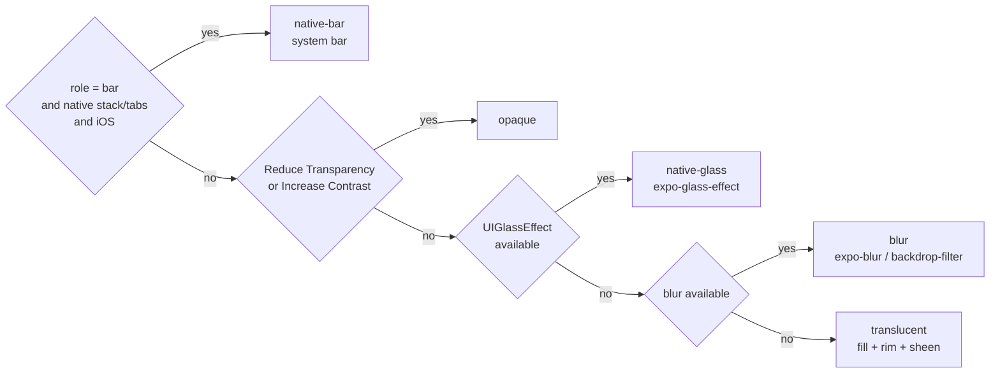

# Flux UI

React Native components whose navigation chrome is **always Liquid Glass**, styled with **Tailwind v4 classes** and built so that **language models write it correctly**.

> Status: v0 scaffold. APIs will change before 1.0.

```tsx
import { Screen, AppBar } from '@flux-ui/core';

export default function Home() {
  return (
    <Screen contentContainerClassName="gap-4 px-4">
      <AppBar title="Discover" largeTitle />
      <View className="rounded-2xl bg-card p-4">
        <Text className="text-lg font-semibold text-card-foreground">Today</Text>
      </View>
    </Screen>
  );
}
```

## Why

- **Glass is the default, not an option.**
  - On iOS, `AppBar` and `FluxTabs` *are* the system navigation and tab bars, so iOS 26+ draws real Liquid Glass and owns the accessibility behaviour.
  - Everywhere else Flux UI draws glass itself, choosing the best tier the device can render.
- **Tailwind syntax as-is.**
  - Spacing, radius and type use Tailwind's own scale, because that is what models already write.
  - Colors are the one exception: only semantic names (shadcn/ui names) exist, so dark mode can't break.
- **Small, closed vocabulary.**
  - The whole API fits in an 8 KB `AGENTS.md` index ([`docs/llm/AGENTS.index.md`](docs/llm/AGENTS.index.md)).
  - Props are closed string unions, so TypeScript rejects unknown values.
  - The runtime resolver warns on unknown classes and names the valid alternative.
  - An ESLint plugin will apply the same check at build time.

## The glass ladder



There is no prop that turns glass off. Only the platform and the user's accessibility settings move a surface down the ladder, and they do it live.

## Packages

| Package | What it does |
|---|---|
| `@flux-ui/tokens` | W3C DTCG 2025.10 tokens (`tokens/*.tokens.json`), compiled to TypeScript constants and a Uniwind `global.css` |
| `@flux-ui/glass` | Tier resolver, `GlassSurface`, `GlassGroup` and the adapter registry. `@flux-ui/glass/expo` registers expo-glass-effect and expo-blur |
| `@flux-ui/core` | `Screen`, `AppBar`, `TabBar`, `Glass`. `@flux-ui/core/expo-router` provides `FluxStack` and `FluxTabs` |
| `@flux-ui/tw-runtime` | Resolves the same class contract at runtime, for hosts with no build step (the Flux WebView, Snack) |

## Setup (Expo SDK 57)

1. Install the packages:
   ```bash
   npx expo install uniwind tailwindcss expo-glass-effect expo-blur react-native-safe-area-context
   ```
2. Wrap the Metro config with `withUniwindConfig(config, { cssEntryFile: './src/global.css' })`. It must be the outermost wrapper.
3. Generate `src/global.css` from the tokens. In this repo that is `pnpm tokens`.
4. In `src/app/_layout.tsx`, add `import '../global.css'` and `import '@flux-ui/glass/expo'`, then render `<FluxStack>`.

See [`apps/expo-example`](apps/expo-example) for a complete app.

## Develop

```bash
pnpm install
pnpm tokens        # regenerate token outputs + the example's global.css
pnpm test          # node:test suites (tokens, glass ladder, class resolver)
pnpm typecheck
pnpm --filter flux-ui-expo-example web
pnpm --filter flux-ui-expo-example ios
```

## Known gaps in v0

- **Android has no blur tier yet.** expo-blur needs a `BlurTargetView` around the content, so Android custom glass is `translucent`.
- **No CLI yet** (`flux-ui init / add / agents-md / doctor`), and no ESLint plugin or MCP server.
- **No packaging.** Packages ship TypeScript source, and publishing needs a build step (react-native-builder-bob).
- **iOS native header items are plain React views.** `unstable_headerRightItems` / `Stack.Toolbar` support is still to do.

## License

MIT © FluxStore and the Flux UI contributors.
