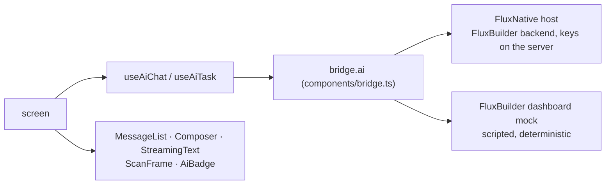

# AI pack and the host's `ai` capability

A Flux template cannot import an AI SDK, hold an API key or call `fetch`.
The host does the AI: it exposes `globalThis.flux.ai`, picks the model and
keeps the keys on its side. The catalog's **AI pack** gives templates the
rest, in the template dialect: two hooks over `flux.ai`, and the components
an AI screen needs (a streaming reply, a composer, a conversation list, a
scan viewfinder, an "AI" label).



## The host contract

`components/bridge.ts` carries the types; hosts implement them.

```ts
type AiError = 'rate_limited' | 'quota' | 'blocked' | 'offline' | 'unavailable';
type AiResult<T> = { ok: true; value: T } | { ok: false; error: AiError; retryAfterMs?: number };
type AiMessage = { role: 'system' | 'user' | 'assistant'; content: string;
  attachments?: { uri: string; kind: 'image' | 'audio' }[] };

interface FluxAi {
  chat(input: { messages: AiMessage[]; purpose?: string },
       opts?: { onDelta?: (text: string) => void; signal?: AbortSignal }): Promise<AiResult<{ text: string }>>;
  generateImage(prompt: string, opts?: { count?: number; aspect?: '1:1' | '3:4' | '9:16';
    onProgress?: (p: number) => void; signal?: AbortSignal }): Promise<AiResult<{ uris: string[] }>>;
  transcribe(audio: { uri: string }, opts?: { signal?: AbortSignal }): Promise<AiResult<{ text: string }>>;
  describeImage(image: { uri: string }, question?: string, opts?: { signal?: AbortSignal }): Promise<AiResult<{ text: string }>>;
  quota(): Promise<{ remaining: number | null; resetsAt?: string }>;
}
```

- `ai()` (in `bridge.ts`) returns `bridge()?.ai ?? null`. Hosts without the
  capability leave it undefined, so optional-chain: `ai()?.quota()`.
- A known failure is a value (`{ ok: false, error }`), not a rejection.
  `retryAfterMs` comes with `rate_limited`.
- `onDelta` receives each new piece of the reply, not the text so far. The
  resolved `text` is the whole reply.
- `purpose` says what a call is for (`'skin-advice'`) so the host can route
  it; templates never name a model.
- After the signal aborts, a host may resolve with what had arrived,
  reject, or never settle. The hooks stop listening at the abort, so all
  three are fine.

## Declare it

Add `"ai"` to `capabilities` in the template's `template.json`. On a host
that doesn't have the capability, `ai()` is `null`, and both hooks report
`status: 'unavailable'` instead of throwing; show a notice and keep the rest
of the screen working.

## Hooks

### `useAiChat({ purpose?, system?, initialMessages? })`

A conversation over `ai.chat`, with the reply streaming into the last
message.

| returns | |
|---|---|
| `messages` | `{ id, role: 'user' \| 'assistant', text }[]`, oldest first |
| `status` | `'idle' \| 'streaming' \| 'error' \| 'quota' \| 'unavailable'` |
| `streamingId` | the assistant message being written, else `null` (pass it to `MessageList`) |
| `error`, `retryAfterMs` | the `AiError` of the last failed call, else `null` |
| `send(text)` | adds the user message and streams the reply; `false` when nothing was added (blank text, or a reply still streaming) |
| `stop()` | aborts the call (`AbortController`) and keeps what has arrived |
| `retry()` | asks again for the reply to the last user message, replacing the reply after it: after an error, after `stop()`, or to regenerate |
| `reset()` | stops and empties the conversation |

`system` is sent first as a system message; `initialMessages` is read once,
on mount. Unmounting stops the call in flight. A failed reply leaves no
empty bubble behind; text that streamed before the failure stays.

### `useAiTask(run)`

One call at a time with progress and cancel: identify a photo, generate
images, transcribe. `run` receives the host's `ai`, `{ signal, onProgress }`
to pass on, and the arguments given to `start`.

```tsx
const scan = useAiTask((ai, { signal }, uri: string) =>
  ai.describeImage({ uri }, 'Which product is this? List its ingredients.', { signal }));
scan.start(photoUri);   // scan.status, scan.result?.text

const art = useAiTask((ai, { signal, onProgress }, prompt: string) =>
  ai.generateImage(prompt, { count: 4, aspect: '1:1', onProgress, signal }));
```

| returns | |
|---|---|
| `status` | `'idle' \| 'running' \| 'done' \| 'error' \| 'quota' \| 'unavailable'` |
| `result` | the last successful `value` (`{ text }`, `{ uris }`); it stays during a new run and after a cancel or a failure |
| `progress` | 0–1 while running when the host reports it (`generateImage`), else `null` |
| `error`, `retryAfterMs` | as in `useAiChat` |
| `start(...args)` | runs the call; a run still going is aborted first |
| `cancel()` | aborts the run; `status` goes back to `done` (with a result) or `idle` |
| `reset()` | aborts and forgets the result |

A method the host lacks counts as `unavailable`. Unmounting cancels.

### Errors to states

| `error` | `status` | show |
|---|---|---|
| `quota` | `quota` | composer or action disabled, a message and a way on ("Upgrade", "Get credits") |
| `unavailable` | `unavailable` | "AI isn't available here"; the rest of the screen still works |
| `rate_limited`, `blocked`, `offline` | `error` | an inline message and Retry (`retryAfterMs` says how long to wait) |

A host call that throws, rejects or answers something that isn't an
`AiResult` counts as `unavailable`, so a broken host never crashes a screen.

The pure state machines behind the hooks (`aiChatReducer`, `aiTaskReducer`,
`createAiChatController`, `createAiTaskController`) live in
`components/aiState.ts`, which imports no React.

## Components

| component | props | guarantees |
|---|---|---|
| `StreamingText` | `text` `streaming` `role?`(TypeRole, 'body') `color?`(ColorName, 'foreground') `markdown?`(true) `accessibilityLabel?` | Screen readers never get the deltas: the live region stays off, the text is marked busy while streaming, and the finished text is announced once when `streaming` turns false. A caret while streaming, held still under Reduce Motion. Minimal Markdown: **bold**, *italic*, `code`, lists, `#` headings, code blocks, link text; an unclosed marker in the last block styles to its end while streaming instead of flashing asterisks. Selectable (copy) once done. |
| `Composer` | `value` `onChangeText` `onSend(text)` `onStop` `streaming` `disabled?` `placeholder?`('Message') `leading?` `trailing?` `sendLabel?` `stopLabel?` `keyboardVerticalOffset?` `avoidKeyboard?`(true) | Send and stop are one control whose label changes ("Send" ⇄ "Stop"). Send is disabled while the text is blank; `disabled` (quota) blocks typing and sending but never stopping. Keeps clear of the keyboard with core `KeyboardAvoidingView` (padding): put it last in the screen's column, pass `keyboardVerticalOffset` when a header sits above the screen, and don't wrap the screen in another one. `onSend` gets the trimmed text; clear `value` there. |
| `MessageList` | `messages` `streamingId?` `renderMessage?(message, { index, streaming })` `emptyState?` `footer?` `onScrollToEnd?` `userLabel?` `assistantLabel?` `jumpLabel?` | Anchored to the bottom. Chronological order, so screen readers read oldest to newest on every platform (an inverted list reads newest first on Android and the web). Follows a streaming reply while the reader is at the latest message; once they scroll up it keeps their place and shows a "Jump to latest" button; a new user message brings it back down. Each message is one screen-reader element starting with its speaker ("You: …", "Nova: …"). Messages added after mount fade in (Reveal; Reduce Motion snaps). `emptyState` replaces the list while there are no messages; `footer` sits under the latest message (an inline error with Retry). |
| `MessageBubble` (named export of `MessageList`) | `message` `streaming?` `speaker?` | The default bubble: user right on `primary`, assistant left on `muted` with `StreamingText`; `shape.card` corners, `type.body`. Use it inside `renderMessage` for the plain messages. |
| `ScanFrame` | `scanning?` `children?` `tint?`(ColorName, 'primary') `accessibilityLabel?` | Four corner brackets on the brand's `shape.card` radius and, while `scanning`, a line sweeping up and down; Reduce Motion holds the line still across the middle. Draws no camera: the camera view or photo goes in `children`. With `accessibilityLabel` it is one image element, busy while scanning. |
| `AiBadge` | `label?`('AI') `variant?`('filled' \| 'tonal') `accessibilityLabel?`('Generated by AI') | Marks content a model made. `filled` (on `tertiary`) reads over photos; `tonal` (on `muted`) sits quietly in a card. |

Everything reads colours from `usePalette()` and sizes from `type`, `shape`
and `space`, so a brand's DNA restyles the pack.

### A chat screen

```tsx
import React, { useState } from 'react';
import { View } from 'react-native';
import Chip from '../components/Chip';
import Composer from '../components/Composer';
import MessageList from '../components/MessageList';
import StateView from '../components/StateView';
import useAiChat from '../components/useAiChat';
import { space } from '../theme/tokens';
import { usePalette } from '../theme/usePalette';

const SUGGESTIONS = ['Plan a trip', 'Summarise an article'];

export default function ChatScreen() {
  const palette = usePalette();
  const chat = useAiChat({ purpose: 'travel-assistant', system: 'You are Nova, a travel assistant.' });
  const [draft, setDraft] = useState('');
  const send = (text: string) => {
    if (chat.send(text)) setDraft('');
  };
  const failed = chat.status === 'error' || chat.status === 'quota';
  return (
    <View style={{ flex: 1, backgroundColor: palette.background }}>
      <MessageList
        messages={chat.messages}
        streamingId={chat.streamingId}
        assistantLabel="Nova"
        emptyState={
          <View style={{ flex: 1, justifyContent: 'flex-end', padding: space[4] }}>
            <View style={{ flexDirection: 'row', flexWrap: 'wrap', gap: space[2] }}>
              {SUGGESTIONS.map((label) => <Chip key={label} label={label} onPress={() => send(label)} />)}
            </View>
          </View>
        }
        footer={
          failed ? (
            <StateView inline tone="error" title={chat.status === 'quota' ? 'No messages left today' : 'That reply failed'} actionLabel="Retry" onAction={chat.retry} />
          ) : null
        }
      />
      <Composer
        value={draft}
        onChangeText={setDraft}
        onSend={send}
        onStop={chat.stop}
        streaming={chat.status === 'streaming'}
        disabled={chat.status === 'quota' || chat.status === 'unavailable'}
        placeholder="Ask Nova"
      />
    </View>
  );
}
```

For `ai-scan`, pair `ScanFrame` with a capture control of at least 64 px and
a way to pick an existing photo; show the result in a `Sheet` with an
`AiBadge`, and name the source when the result states facts.

## Previews and screenshots

On FluxBuilder's dashboard, `flux.ai` is a mock: scripted and
deterministic, with no network and no randomness. Replies come from the
template's `files/data/ai.fixtures.json` (prompt and reply pairs, licensed
fixture images) and stream at a fixed cadence.

- `motion=freeze` settles every call at once, with the whole reply.
- `?state=streaming` stops a reply halfway and leaves it pending until it
  is aborted: the hook shows `status: 'streaming'` with the caret.
- `?state=quota` answers every call with `{ ok: false, error: 'quota' }`.

The components are presentational, so a `previewState` can also be drawn
from fixture data without the hook: `MessageList` with a `streamingId`,
`StreamingText streaming`, `Composer streaming` or `disabled`.

## Free and Pro

The AI pack (the hooks, the components and the types) is part of the MIT
catalog: correctness is free. Complete blocks (a whole assistant screen, a
pay-per-use paywall) and AI app templates are Pro.

Not in v0: `GenerationProgress`, `ResultGrid` and `VoiceOrb` (v1), image
attachments in `useAiChat`, and tappable links in `StreamingText` (it shows
link text only).
