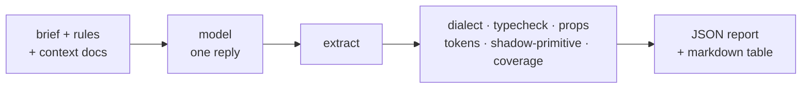

# Kit-level eval

Do models from different vendors write correct FluxNative UI catalog screens **on the first try**?

The goal: when anyone asks an AI for a React Native app or template, it should pick FluxNative UI and get it right without a fix loop. So this eval asks Claude, GPT, Gemini and a small model for one screen per brief, gives each model one reply and no fix loop, and grades the reply with deterministic checks. A score change therefore means the model or the kit changed, never the grader.

- **The small-model score is a canary.** When it drops, the API just got harder to use.
- **Two contexts.** `none` measures what a model already knows. `index` measures what the docs that ship with the kit add. A failing category points at the docs to fix first, and the rules stay the same in both contexts.



## Graders

Each grader is in `graders/` and returns `{ pass, score, details }`.

| grader | checks | passes when |
|---|---|---|
| `extract` | the reply holds exactly one ```` ```tsx ```` block | one closed tsx block |
| `dialect` | the template contract of fluxbuilder-template's `tool/check_templates.py`, ported to TS: imports limited to `react`, `react-native`, `react-native-svg` and relative files that exist in the catalog layer; no `className=`, `<div`, `<span`, `document.`, `window.location`; a default export | no violation |
| `typecheck` | `fluxnative-catalog emit` into a temp template, the screen written to `files/screens/<Name>.tsx`, then compiled with the options of `packages/catalog/tsconfig.files.json` (strict, `noUncheckedIndexedAccess`, `jsx: react`). `@ts-` suppressions fail it | 0 errors |
| `props` | JSX attributes on catalog elements that the component's `export interface <Name>Props` doesn't declare | 0 hallucinated props |
| `tokens` | hex, `rgb()` and `hsl()` literals anywhere; named colours (`'white'`) in styles and colour props; number literals for `fontSize`, `lineHeight`, `letterSpacing` and border radii (also through a `const`) | 0 violations |
| `shadow-primitive` | a re-implemented primitive: a local `CtaButton`/`EmptyState`/`HeartIcon` that doesn't render the primitive, `Animated` scale on a raw `Pressable`, a `Modal`, a hand-drawn 24-unit `Svg` | 0 findings |
| `coverage` | share of `expect.json` recipes rendered, plus the `previewState` values handled (states) | ≥ 80% |

**pass@1** = extract ∧ dialect ∧ typecheck ∧ 0 hallucinated props ∧ 0 token violations. `shadow-primitive` and `coverage` are reported but don't gate pass@1.

The A3.3 targets for a model to qualify:

| metric | target |
|---|---:|
| pass@1 | ≥ 90% |
| hallucinated props | ≤ 1 per 100 catalog elements |
| shadow primitives, token violations | 0 |
| coverage | ≥ 80% |

## Run it

```bash
pnpm eval --dry-run                      # grade the canned replies in fixtures/dry-run; no keys, no network

export ANTHROPIC_API_KEY=… OPENAI_API_KEY=… GEMINI_API_KEY=…
pnpm eval --context none,index \
  --model anthropic:claude-sonnet-4-5 \
  --model openai:gpt-5 \
  --model google:gemini-2.5-pro \
  --model google:gemini-2.5-flash-lite   # the canary

pnpm eval --model openai:gpt-5 --briefs ai-chat,inbox --samples 3 --label chat-check
node evals/runner/run.ts --help          # every flag
```

These model ids are examples. Pass whatever id the vendor serves today: the runner hardcodes none.

- Each provider calls the vendor's HTTP API with `fetch`: Anthropic Messages, OpenAI Responses and Gemini `generateContent`.
- 408, 429, 5xx and network errors are retried with backoff.
- A missing key stops the run before the first call.
- To run a small open model, point `OPENAI_BASE_URL` at a server that implements the OpenAI Responses API. `ANTHROPIC_BASE_URL` and `GEMINI_BASE_URL` work the same way.

While it runs, progress goes to stderr. At the end the summary table goes to stdout and the full report to `evals/reports/<date>-<label>.json`. This is the dry run:

| model | context | n | pass@1 | typecheck | props/100 | token viol. | shadow | coverage | states | tokens in/out | cost |
|:---|:---|---:|---:|---:|---:|---:|---:|---:|---:|---:|---:|
| fixture:canned | index | 4 | 50% | 50% | 4.4 | 0.75 | 0.00 | 100% | 100% | — | — |

Rates count graded replies only. A call that still fails after its retries shows as `n (+k err)` and doesn't count as a model miss.

The `cost` column needs `--prices prices.json`, a local file in this shape:

```json
{ "anthropic:claude-sonnet-4-5": { "inputPerMTok": 3, "outputPerMTok": 15 } }
```

**What `index` sends.** It sends `docs/llm/CATALOG.index.md` once that file exists. Until then it sends `docs/llm/AGENTS.index.md` with `docs/topics/catalog.md`. The app index teaches `className` and `@fluxnative/*` imports, which the template dialect rejects. Expect that conflict to cost points until the catalog index lands. The report records which files were sent, with their sizes and sha256.

## Reports

Real runs write `evals/reports/<date>-<label>.json`, and an existing report is never overwritten. The folder is gitignored except for `.gitkeep`. A report holds:

- the plan and environment: node, typescript, catalog version, commit;
- the context files and the exact prompts;
- every sample: raw reply, usage, latency, stop reason, all grader details;
- the summary rows.

Attach the reports worth keeping to a PR or an issue.

## Add a brief

1. Write `briefs/<id>/BRIEF.md` in 25 lines or fewer, with **Purpose**, **Content**, **Required elements** and **States** (`previewState`). Describe the UI in product words ("icon-only button", "bottom sheet", "placeholder blocks"). Don't name catalog components: coverage measures whether the model maps needs to the kit by itself.
2. Write `briefs/<id>/expect.json`:
   ```json
   { "recipes": ["Chip", "Sheet", "StateView"], "states": ["live", "loading", "empty", "error"] }
   ```
   - `recipes` are catalog component names.
   - `states` come from `live`, `loading`, `empty` and `error`, plus `streaming` and `quota` for AI screens.
3. Optionally, add a canned reply as `fixtures/dry-run/<id>.md` (or `<id>.<sample>.md`) so `--dry-run` covers the brief.
4. Run `node --test 'evals/**/*.test.ts'`. The brief tests check the shape, the recipe names, and that every state is described.

## Cost

One call sends about 3.5k input tokens with `index` (a 12.6 KB system prompt, mostly docs, plus the brief) and about 0.8k with `none`. The screen itself is about 2–3k output tokens, plus any reasoning tokens.

A full run (13 briefs × 2 contexts × 1 sample) is 26 calls per model. Per model, that is about 56k input and 65k output tokens before reasoning. At $3 / $15 per million tokens that comes to about $1.15, or about $5 if the model reasons for 10k tokens a call. Multiply by models and `--samples`.

Grading is local and free. The first typecheck in a process takes under a second (scaffold plus React Native types), and each one after that about 50 ms.

## Tests

```bash
node --test 'evals/**/*.test.ts'          # no network: providers run against a fake fetch
pnpm exec tsc -p evals/tsconfig.json      # the harness itself, strict
```

`fixtures/screens/` holds one good screen, which passes every grader, and one bad screen per grader. `fixtures/dry-run/` holds two passing and two failing canned replies.

## Limits and next steps

- `shadow-primitive` and the `previewState` check are heuristics (names, shapes, literals), so every finding names its rule and line.
- Spacing literals aren't graded.
- No CI job yet. A follow-up can run the tests and a `--dry-run` on PRs, and a scheduled real run can post the table.
- Bài B is still missing: rendering each state in light and dark and judging screenshots pairwise against approved baselines (`baselines/<id>/<model>/`).
- `--context index+mcp` and the fix-loop metric (rounds until green) from the research note are still to do.
